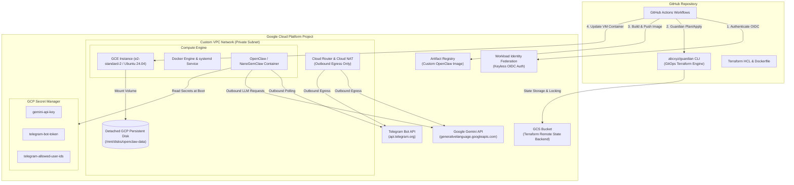

# Technical Architecture & System Design: OpenClaw / NanoGemClaw on GCP

This document details the system architecture, key architectural decisions, and modular repository structure for running **OpenClaw** (or **NanoGemClaw**) on Google Cloud Platform (GCP) Compute Engine (GCE), integrated with **Google Gemini API** and **Telegram**.

---

## 1. System Architecture

The deployment architecture consists of a **Containerized GCE VM Instance** with a **Detached Persistent Disk**, managed via modular **Terraform (HCL)** and deployed automatically using **`abcxyz/guardian`** via **GitHub Actions with Workload Identity Federation (WIF)**.



---

## 2. Key Architecture Decisions & Recommendations

### A. OS & Container Image Strategy
* **GCE VM Base Image**: Standard **Ubuntu 24.04 LTS** (`ubuntu-os-cloud/ubuntu-2404-lts`) provisioned via Terraform.
* **Container Registry**: **GCP Artifact Registry** (`<region>-docker.pkg.dev/<project-id>/openclaw/app:latest`).
* **Container Build Workflow**: GitHub Actions builds the customized `Dockerfile` on `git push` to `main`, pushes it to Artifact Registry, and triggers the GCE VM container update.

### B. GitOps Tooling: `abcxyz/guardian`
* **Infrastructure Engine**: Uses Google's official open-source **`abcxyz/guardian`** CLI for managing Terraform plan and apply execution in GitHub Actions.
* **Pull Request Workflow (`terraform-plan.yml`)**: Runs `guardian terraform plan -dir=terraform -storage=<GCS_STATE_BUCKET>` on PRs and posts plan output comments directly to the GitHub PR.
* **Merge Workflow (`deploy.yml`)**: Runs `guardian terraform apply -dir=terraform -storage=<GCS_STATE_BUCKET>` on merges to `main`.
* **State Backend**: Centralized Google Cloud Storage (`gcs`) bucket with state locking.

### C. LLM Provider: Direct Gemini API Keys
* **Secret Storage**: `GEMINI_API_KEY` stored in **GCP Secret Manager** (`google_secret_manager`).
* **Runtime Injection**: GCE startup script uses `gcloud secrets versions access latest` under the GCE Service Account identity to inject `GEMINI_API_KEY` into a RAM disk (`tmpfs`) environment file read by Docker.

### D. Channel Gateway: Telegram Bot
* **Communication**: Outbound long-polling connection to `api.telegram.org` (no open inbound firewall ports required).
* **Secrets**: `TELEGRAM_BOT_TOKEN` and `TELEGRAM_ALLOWED_USER_IDS` stored in GCP Secret Manager.
* **Access Control**: Strict user ID whitelist enforcement.

### E. Persistent Storage: Detached GCP Persistent Disk
* **State Preservation**: SQLite database files (`memory.db`, conversation logs, vector indices) live on an independent GCP Persistent Disk mounted at `/mnt/disks/openclaw-data`.
* **Immutability**: Destroying or replacing the GCE VM instance during Terraform updates **never destroys state**.

---

## 3. Modular Terraform Repository Structure

```
.
├── .github/
│   └── workflows/
│       ├── terraform-plan.yml     # Runs Guardian Terraform Plan on PRs
│       └── deploy.yml             # Runs Guardian Terraform Apply & builds/deploys Docker image
├── terraform/
│   ├── main.tf                    # Primary orchestration & backend GCS config
│   ├── variables.tf               # Input variables (project_id, region, instance_type)
│   ├── outputs.tf                 # Instance IP, SA email, WIF Provider ID
│   ├── terraform.tfvars.example   # Example configuration values
│   └── modules/
│       ├── vpc/                   # VPC network, private subnet, Cloud Router, Cloud NAT
│       ├── iam/                   # Service Accounts, IAM bindings, Workload Identity Pool
│       ├── secrets/               # GCP Secret Manager definitions & IAM grants
│       ├── storage/               # Standalone GCP Persistent Disk for agent data
│       └── compute/               # GCE VM instance, metadata startup-script template
├── docker/
│   ├── Dockerfile                 # OpenClaw / NanoGemClaw container definition
│   └── startup-script.sh          # VM bootstrap: disk mount, secret fetching, Docker run
└── README.md
```
