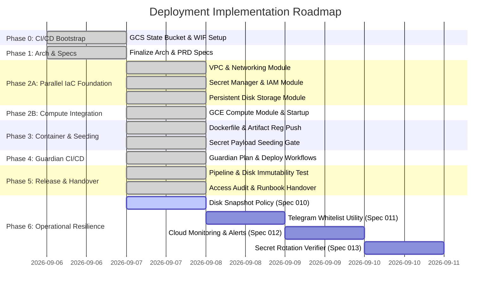

# Deployment Implementation Roadmap: OpenClaw on GCP

This document tracks the milestones, phases, and execution schedule for provisioning and deploying **OpenClaw** on Google Cloud Platform (GCP) using Terraform and `abcxyz/guardian`.

---

## 1. Timeline & Phases Overview

---

## 2. Detailed Phase Tasks

### Phase 0: Environment & CI/CD Bootstrap *(Complete)*
* **GCS Terraform State Backend**: Provision initial Google Cloud Storage bucket for centralized Terraform state locking.
* **Workload Identity Federation (WIF)**: Set up initial GCP Workload Identity Pool and Provider for keyless GitHub Actions OIDC authentication.
* **Deployment Service Account**: Create Guardian CI/CD deployment service account with required IAM roles (`roles/storage.admin`, `roles/compute.admin`, `roles/secretmanager.admin`).

### Phase 1: Architecture & Specification *(Complete)*
* **Architecture Specs**: Finalized specs for Ubuntu 24.04 GCE VM, detached persistent disk, GCP Artifact Registry, direct Gemini API keys, Telegram bot gateway, and `abcxyz/guardian` GitOps CI/CD.

### Phase 2A: Parallel Modular IaC (Foundation) *(Complete)*
* `modules/vpc`: VPC network, private subnet, Cloud Router, Cloud NAT (authored & validated concurrently).
* `modules/secrets`: Secret Manager resource definitions (`gemini-api-key`, `telegram-bot-token`, `telegram-allowed-user-ids`) and IAM Secret Accessor bindings.
* `modules/storage`: Standalone `google_compute_disk` persistent disk definition (`/mnt/disks/openclaw-data`).

### Phase 2B: Modular IaC (Compute Integration) *(Complete)*
* `modules/compute`: `google_compute_instance` definition integrating VPC subnetwork, attached persistent disk, and `metadata_startup_script`.

### Phase 3: Containerization & Pre-Boot Seeding Gate *(Complete)*
* `docker/Dockerfile`: Application container definition for OpenClaw.
* **Artifact Registry Image Push**: Build container image and push initial version to GCP Artifact Registry before VM provisioning.
* **Secret Payload Seeding Gate**: Seed Secret Manager with initial secret versions (`GEMINI_API_KEY`, `TELEGRAM_BOT_TOKEN`, `TELEGRAM_ALLOWED_USER_IDS`) to prevent boot-time secret fetching errors.
* `docker/startup-script.sh`: VM bootstrap script to mount `/dev/disk/by-id/google-openclaw-data` to `/mnt/disks/openclaw-data`, fetch secrets from GCP Secret Manager, pull image from GCP Artifact Registry, and launch Docker container.

### Phase 4: Guardian CI/CD Automation Setup *(Complete)*
* `.github/workflows/terraform-plan.yml`: Configure PR checks using `abcxyz/guardian-setup` to execute `guardian terraform plan -dir=terraform -storage=<GCS_STATE_BUCKET>`.
* `.github/workflows/deploy.yml`: Configure merge workflow using `abcxyz/guardian-setup` to run `guardian terraform apply`, build/push container image updates, and refresh GCE container service.

### Phase 5: Release Verification & Operational Handover *(Complete)*
* **GitOps Pipeline Dry-Run**: Validate `terraform-plan.yml` on PR and `deploy.yml` on merge.
* **Disk Immutability & Persistence Test**: Execute simulated VM replacement (`terraform apply -replace`) and verify SQLite database state on persistent disk survives intact across VM recreation.
* **Access Control Verification**: Audit Telegram bot whitelist enforcement by verifying rejection behavior for unauthorized Telegram User IDs (per CUJ 3).
* **Operational Runbook & Handover**: Document secret rotation procedures, disk backup snapshots, and emergency rollback runbooks.

### Phase 6: Day-2 Operational Resilience & Security Hardening *(Active)*
* **Spec 010: Automated Disk Snapshot Policy**: Define Terraform `google_compute_resource_policy` for daily disk snapshots with 7-day retention and automated verification script (`scripts/verify_disk_snapshots.sh`).
* **Spec 011: Telegram Whitelist Management Utility**: Develop `scripts/manage_whitelist.sh` for auditing, validating, adding, and removing allowed Telegram User IDs in Secret Manager with zero downtime.
* **Spec 012: GCP Cloud Monitoring & Health Metrics**: Provision Terraform `google_monitoring_alert_policy` resources and log-based metrics for GCE container restarts, Gemini rate limits (429), and unauthorized access attempts.
* **Spec 013: Automated Secret Rotation & Verification**: Author `scripts/rotate_and_verify_secrets.sh` to execute safe runtime credential rotation with post-rotation container state and database health verification.

