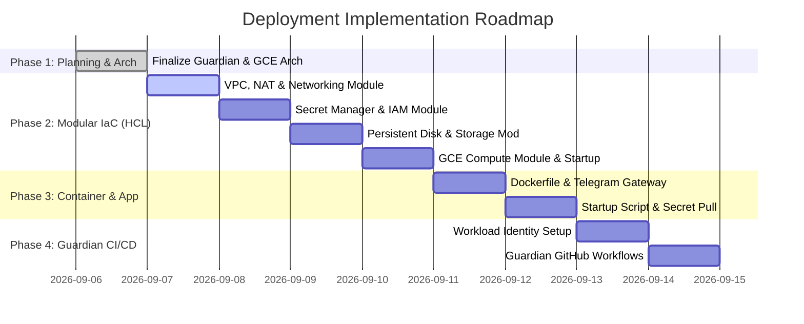

# Deployment Implementation Roadmap: OpenClaw / NanoGemClaw on GCP

This document tracks the milestones, phases, and execution schedule for provisioning and deploying **OpenClaw** (or **NanoGemClaw**) on Google Cloud Platform (GCP) using Terraform and `abcxyz/guardian`.

---

## 1. Timeline & Phases Overview

---

## 2. Detailed Phase Tasks

### Phase 1: Architecture & Specification *(Complete)*
* Architecture finalized for Ubuntu 24.04 GCE VM, detached persistent disk, GCP Artifact Registry, direct Gemini API keys, Telegram channel, and **`abcxyz/guardian`** GitOps CI/CD.

### Phase 2: Modular Terraform Infrastructure (HCL)
* `modules/vpc`: VPC network, private subnet, Cloud Router, Cloud NAT.
* `modules/secrets`: Secret Manager definitions (`gemini-api-key`, `telegram-bot-token`, `telegram-allowed-user-ids`).
* `modules/iam`: Service Accounts, Secret Accessor bindings, WIF Pool & Provider.
* `modules/storage`: Independent `google_compute_disk` resource.
* `modules/compute`: `google_compute_instance` with `metadata_startup_script`.

### Phase 3: Containerization & Startup Logic
* `docker/Dockerfile`: OpenClaw / NanoGemClaw application image.
* `docker/startup-script.sh`: Mount `/dev/disk/by-id/google-openclaw-data` to `/mnt/disks/openclaw-data`, fetch secrets from GCP Secret Manager, pull image from GCP Artifact Registry, and launch Docker container.

### Phase 4: Guardian CI/CD Pipeline Setup
* Set up `.github/workflows/terraform-plan.yml` using `abcxyz/guardian-setup` to run `guardian terraform plan -dir=terraform -storage=<GCS_STATE_BUCKET>`.
* Set up `.github/workflows/deploy.yml` using `abcxyz/guardian-setup` to run `guardian terraform apply -dir=terraform -storage=<GCS_STATE_BUCKET>`, build & push Docker image to GCP Artifact Registry, and trigger GCE VM container refresh.
